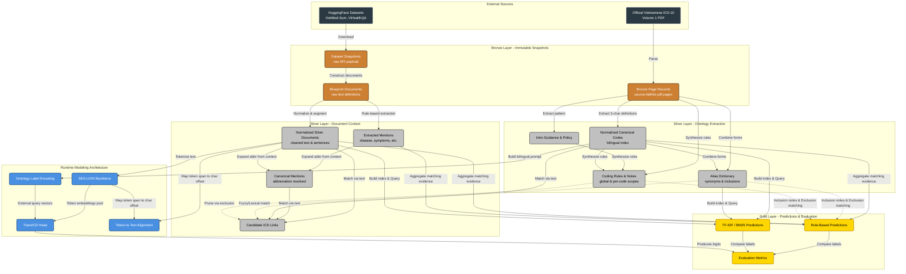

# ViTransICD

## Data Pipeline

```mermaid
flowchart TD
    %% Styles & Theming
    classDef input fill:#2B3A42,stroke:#FFF,stroke-width:2px,color:#FFF,rx:5px,ry:5px
    classDef bronze fill:#CD7F32,stroke:#5A3A18,stroke-width:2px,color:#FFF,rx:5px,ry:5px
    classDef silver fill:#C0C0C0,stroke:#555,stroke-width:2px,color:#000,rx:5px,ry:5px
    classDef runtime fill:#4A90E2,stroke:#1A4B82,stroke-width:2px,color:#FFF,rx:5px,ry:5px
    classDef gold fill:#FFD700,stroke:#B8860B,stroke-width:2px,color:#000,rx:5px,ry:5px

    %% --------- External Context ---------
    subgraph External [External Sources]
        HF[HuggingFace Datasets<br/>VietMed-Sum, ViHealthQA]:::input
        PDF[Official Vietnamese ICD-10<br/>Volume 1 PDF]:::input
    end

    %% --------- Bronze Layer ---------
    subgraph Bronze [Bronze Layer - Immutable Snapshots]
        direction TB
        B_Snaps[Dataset Snapshots<br/>raw API payload]:::bronze
        B_Docs[Blueprint Documents<br/>raw text definitions]:::bronze
        B_Pages[Bronze Page Records<br/>source-faithful pdf pages]:::bronze
    end

    %% --------- Silver Layer (Ontology) ---------
    subgraph SilverON [Silver Layer - Ontology Extraction]
        direction TB
        S_Guidance[Intro Guidance & Policy]:::silver
        S_Codes[Normalized Canonical Codes<br/>bilingual index]:::silver
        S_Alias[Alias Dictionary<br/>synonyms & inclusions]:::silver
        S_Rules[Coding Rules & Notes<br/>global & per-code scopes]:::silver
    end

    %% --------- Silver Layer (Documents) ---------
    subgraph SilverDC [Silver Layer - Document Context]
        direction TB
        S_Docs[Normalized Silver Documents<br/>cleaned text & sentences]:::silver
        S_Mentions[Extracted Mentions<br/>disease, symptoms, etc.]:::silver
        S_CanMentions[Canonical Mentions<br/>abbreviation resolved]:::silver
        S_CandLinks[Candidate ICD Links]:::silver
    end

    %% --------- Runtime Models ---------
    subgraph Runtime [Runtime Modeling Architecture]
        direction TB
        M_Labels[Ontology Label Encoding]:::runtime
        M_Backbone[SEA-LION Backbone]:::runtime
        M_Head[TransICD Head]:::runtime
        M_Align[Token-to-Text Alignment]:::runtime
    end

    %% --------- Gold Layer (Baselines) ---------
    subgraph Gold [Gold Layer - Predictions & Evaluation]
        direction TB
        G_Rule[Rule-Based Predictions]:::gold
        G_Lexical[TF-IDF / BM25 Predictions]:::gold
        G_Eval[Evaluation Metrics]:::gold
    end

    %% ==========================================
    %% Edges & Workflows
    %% ==========================================

    %% 1. Input to Bronze
    HF -->|Download| B_Snaps
    B_Snaps -->|Construct documents| B_Docs
    PDF -->|Parse| B_Pages

    %% 2. Bronze to Silver (Ontology Pipeline)
    B_Pages -->|Extract pattern| S_Guidance
    B_Pages -->|Extract 3-char definitions| S_Codes
    B_Pages & S_Codes -->|Combine forms| S_Alias
    B_Pages & S_Guidance & S_Codes -->|Synthesize rules| S_Rules

    %% 3. Bronze to Silver (Document Pipeline)
    B_Docs -->|Normalize & segment| S_Docs
    B_Docs -->|Rule-based extraction| S_Mentions
    S_Mentions & S_Docs -->|Expand abbr from context| S_CanMentions

    %% 4. Cross-pipeline joining
    S_Docs & S_CanMentions & S_Codes -->|Match via text| S_CandLinks
    S_Alias -.->|Fuzzy/Lexical match| S_CandLinks
    S_Rules -.->|Prune via exclusion| S_CandLinks

    %% 5. Baselines (To Gold Layer)
    S_Docs & S_Mentions & S_Codes -->|Aggregate matching evidence| G_Rule
    S_Alias & S_Rules -.->|Inclusion notes & Exclusion matching| G_Rule

    S_Docs & S_Codes & S_Alias -->|Build index & Query| G_Lexical

    %% 6. Neural Modeling (Runtime)
    S_Codes -->|Build bilingual prompt| M_Labels
    S_Docs -->|Tokenize text| M_Backbone
    M_Backbone -->|Token embeddings pool| M_Head
    M_Labels -->|External query vectors| M_Head
    M_Backbone & S_Docs -->|Map token span to char offset| M_Align

    %% 7. Evaluation metrics
    G_Rule -->|Compare labels| G_Eval
    G_Lexical -->|Compare labels| G_Eval
    M_Head -->|Produces logits| G_Eval
```

## Files

- [docs/tasks/PLAN.md](docs/tasks/PLAN.md): the task planning.
